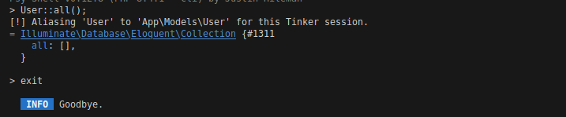
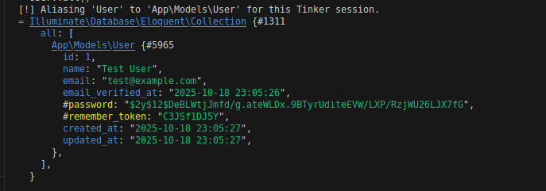
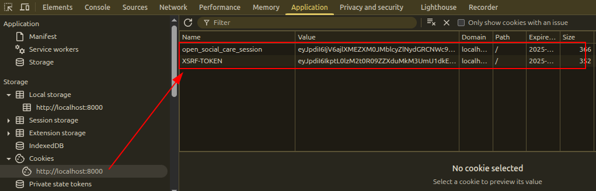
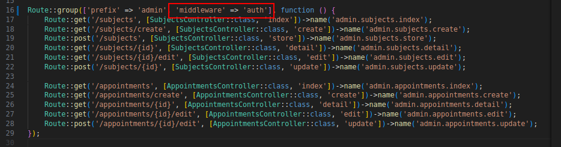

# Autenticação de Usuários no Laravel

**Documentação oficial:** [https://laravel.com/docs/12.x/authentication](https://laravel.com/docs/12.x/authentication)

O Laravel oferece diversas estratégias e pacotes para autenticação, além de *starter kits* que facilitam o desenvolvimento inicial de sistemas com login.

---

## Métodos de Autenticação

Existem dois principais métodos de autenticação no Laravel:

1. **Passport**

   * Biblioteca mais elaborada.
   * Utilizada para autenticações sociais (Google, Microsoft, GitHub, etc.).

2. **Sanctum**

   * Pacote mais leve.
   * Ideal para aplicações *SPA* (Single Page Applications) e autenticação via *tokens*.

---

## Quando usar cada um

| Tipo de aplicação                                              | Melhor escolha |
| -------------------------------------------------------------- | -------------- |
| Aplicações simples, SPAs, uso de tokens                        | **Sanctum**    |
| Aplicações web com autenticação externa (Google, GitHub, etc.) | **Passport**   |

**Guia de autenticação manual:**
[https://laravel.com/docs/12.x/authentication#authenticating-users](https://laravel.com/docs/12.x/authentication#authenticating-users)

---

## Interagindo com o Banco via Tinker

Podemos utilizar o **Tinker** para interagir com o banco de dados pelo terminal:

```bash
php artisan tinker
User::all();
```

Por padrão, o Laravel já possui uma classe `User` em:
[`app/Models/User.php`](../open-social-care/app/Models/User.php)

Ao executar o comando acima, o resultado inicial será uma lista vazia:



---

## Criando Usuários com Seeders

Para popular o banco de dados automaticamente, utilizamos **Seeders**.
O Laravel já inclui um *seeder* padrão para criar um usuário autenticável.

Arquivo: [`database/seeders/DatabaseSeeder.php`](../open-social-care/database/seeders/DatabaseSeeder.php)

Esse seeder cria um usuário padrão:

* **Nome:** Test User
* **E-mail:** [test@example.com](mailto:test@example.com)
* **Senha:** `password` (criptografada automaticamente)

A senha é definida nas **Factories**, que serão abordadas em uma próxima aula:
[`database/factories/UserFactory.php`](../open-social-care/database/factories/UserFactory.php)

Após rodar o seeder e executar novamente `User::all()`, teremos:



**Usuário criado com sucesso!**

---

## Verificando a Autenticação

Ao realizar o login, o usuário é redirecionado para a tela de listagem de sujeitos.
Mas como confirmar se ele realmente está autenticado?

Podemos verificar nos **cookies** do navegador — existirão dois tokens:

* **Token de sessão:** autentica o usuário.
* **Token XSRF:** garante a integridade dos formulários (*Cross-Site Request Forgery protection*).



---

## Protegendo Rotas

Mesmo com o login, ainda é possível acessar rotas privadas diretamente.
Para impedir isso, é necessário proteger as rotas com *middleware*.

**Documentação:**
[https://laravel.com/docs/12.x/authentication#password-confirmation-protecting-routes](https://laravel.com/docs/12.x/authentication#password-confirmation-protecting-routes)

### Adicione o middleware na rota:

```php
'middleware' => 'auth'
```

Dessa forma, se o usuário não estiver autenticado, ele será redirecionado automaticamente para a página de login.



---

## Recomendação: Laravel Sanctum

Se o objetivo for construir **APIs**, recomenda-se estudar o **Sanctum**:
[https://laravel.com/docs/12.x/sanctum#issuing-api-tokens](https://laravel.com/docs/12.x/sanctum#issuing-api-tokens)

O Laravel gera **tokens HTTP Only**, o que significa que o JavaScript **não consegue acessá-los**, adicionando uma camada extra de segurança.

Leia a documentação para entender como autenticar APIs com tokens.
